# ⏳ Endlos Planner | Hybrid Time Mapping System

The **Endlos Planner** is a routine monitoring and diagnostic system designed to transform a Google Sheet (the *"Daten"*) into a Real-Time Analytical Dashboard. 

It acts as a relentless supervisor of your time, quantifying focus, leisure, physical/mental health, and distractions to generate an executive daily performance report.

  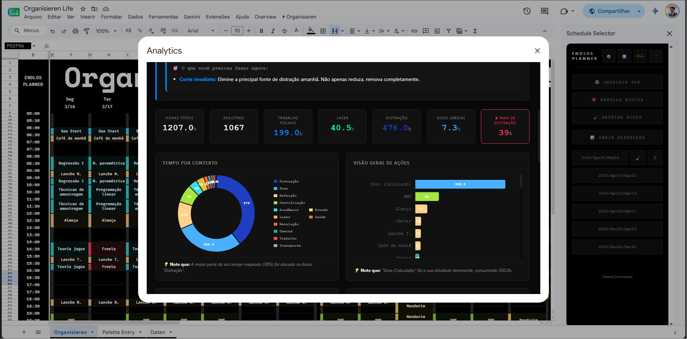

### 📈 Analytical Capabilities Showcase

The system provides multiple interactive views to slice the data by context, daily patterns, and biological metrics:

  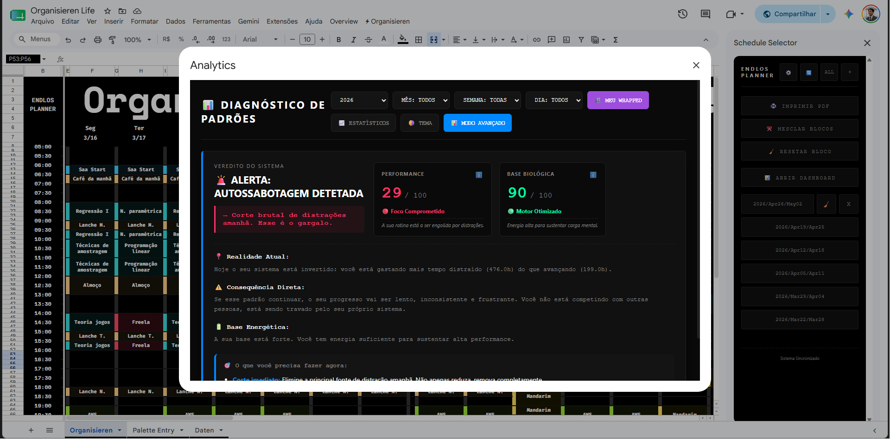
  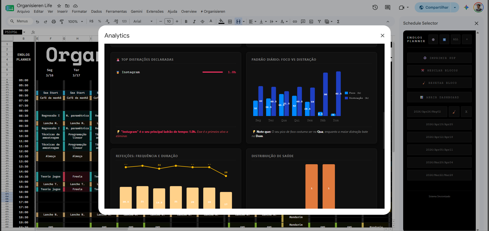
   
  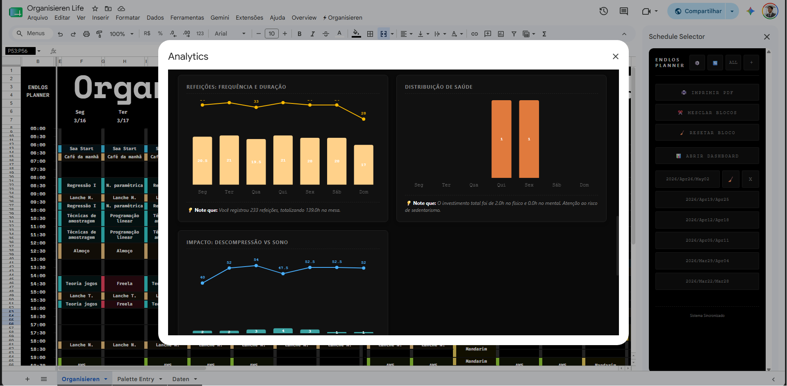
  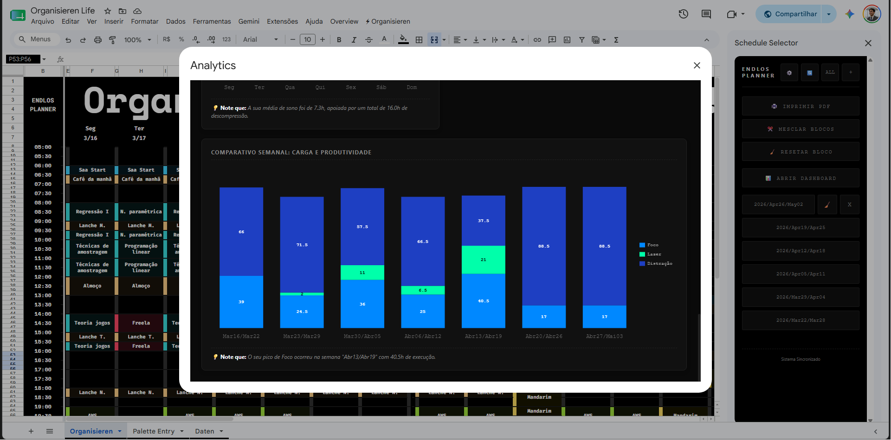

---

## 🎯 Project Overview (The STAR Method)

* **Situation:** The need to track daily productivity revealed that market applications were rigid or did not allow for complex cross-analysis of behavior.
* **Task:** Develop a custom, frictionless system using the familiarity of a spreadsheet combined with the analytical power of an interactive BI dashboard.
* **Action:** Engineered a full-stack application using Google Apps Script as the backend, Google Sheets as a relational database, and Vanilla JS/HTML for a reactive frontend. Implemented concurrency protection (*Mutex*) and *polling* for real-time synchronization.
* **Result:** A robust personal telemetry ecosystem that calculates a daily Performance Score cross-referenced with biological metrics, shielded against state breakage and featuring an immersive interface.

---

## 🎨 Visual Customization (Themes)

The system adapts to user preferences, supporting multiple themes dynamically rendered in the spreadsheet, ranging from modern to classic approaches:

  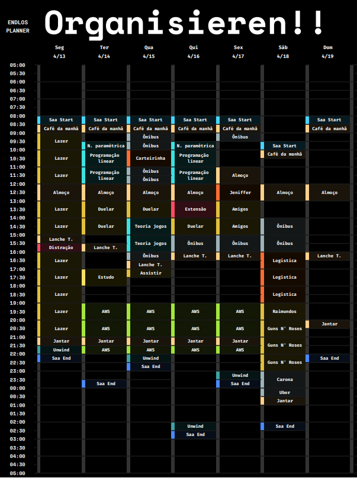
  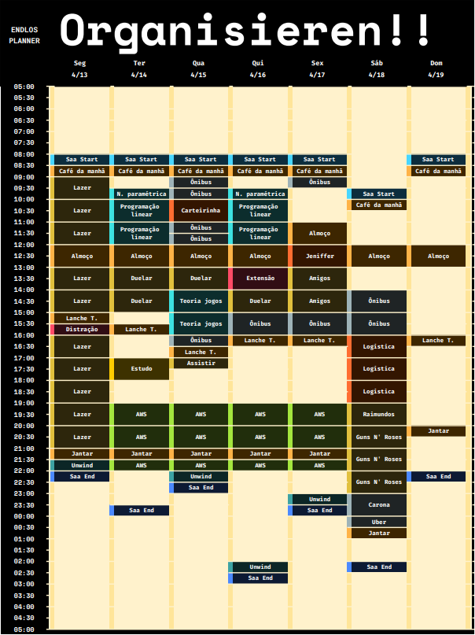
  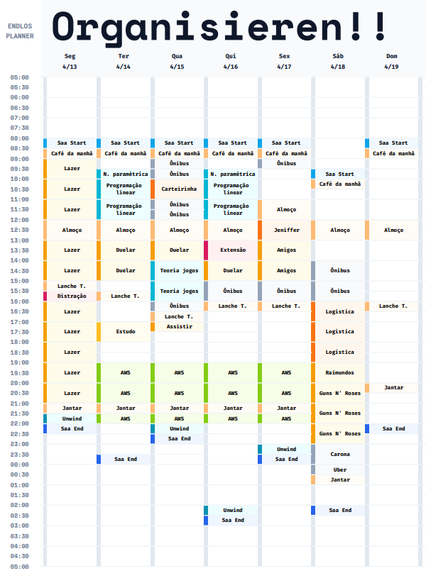
  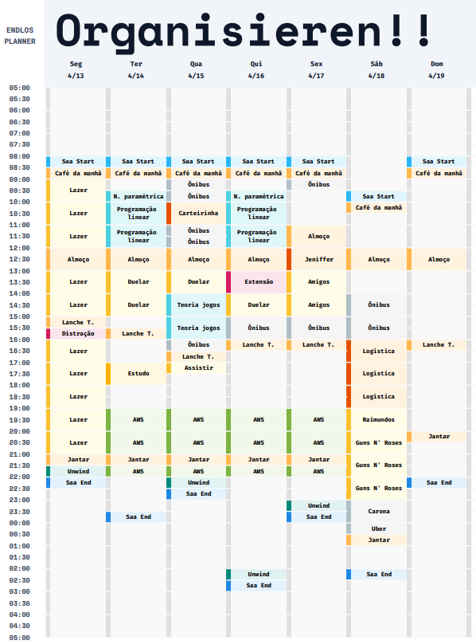

---

## 🚀 Reactive Architecture (Google Sheets as a State Machine)

The biggest challenge in building Google Apps Script applications is the asynchronous nature and heavy *caching* of Google Sheets. To ensure database consistency and interface fluidity (Sidebar and HTML Dashboard), the system was designed under the principles of **Single Source of Truth (SSOT)** and **Protected Concurrency**.

  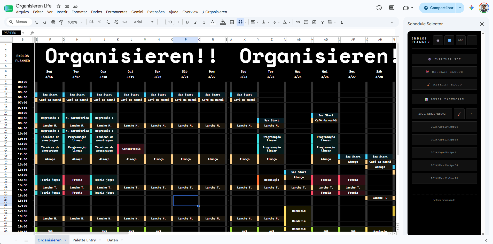

### 1. The Mutex Engine (`LockService`)
* **Problem:** Copying and pasting dozens of time blocks at once would trigger dozens of parallel `onEdit` triggers, collapsing the spreadsheet under multiple repaints (`flush`).
* **Solution:** Implementation of a *Thread Lock* (Mutex). Any edit triggers a `Utilities.sleep(1500)` *debounce*. Only the surviving *thread* obtains the `LockService` execution key, forcing serialization. Simultaneous repaints never occur.

### 2. The System Config Builder (Reactive Sidebar)
The configuration of colors, operation modes (Input/Output/Waste), and action grouping was abstracted from hardcoded logic and handed over to user control via the `Palette Entry` tab.

  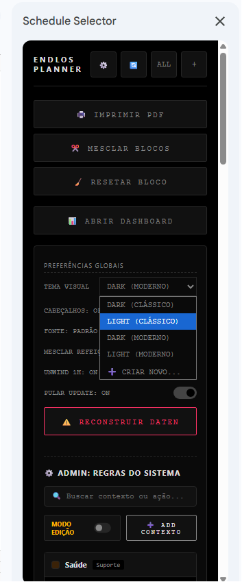
  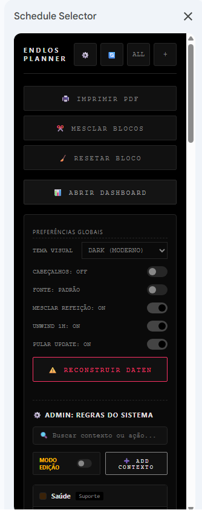
  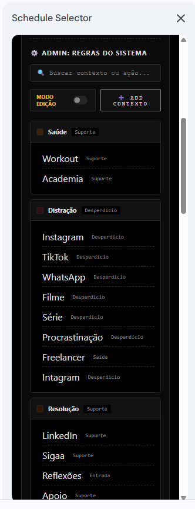

 

* The HTML Frontend does not hold state (Stateless UI).
* It uses **Passive Polling**: the UI interrogates the spreadsheet every 5 seconds, checking the `SYS_VERSION`. If it detects a structural change made by another tab, the UI invalidates its local cache and automatically rebuilds the dependency tree on the screen.

### 3. Orphan Actions Queue (Exception Handling)
If the user inserts a raw action into the timeline (`Organisieren` tab) without defining its "Impact/Mode" in the system, the *backend* intercepts it.
* The script updates the `SYS_VERSION` and injects the action into a pending array.
* The Sidebar locks itself with a Forced Modal (dark overlay) and requires the user to categorize the action before continuing to edit the spreadsheet, shielding the consistency of the Dashboard reports.

---

## 📊 The Intelligence Dashboard

The Analytical UI converts the hours registered in the database (`Daten`) into a productivity matrix, calculating the following critical axes:

1. **Performance Score (0-100):** Calculation of the Pure Execution vs. Distraction rate.
2. **Biological Base (0-100):** Cross-referencing Sleep hours (minimum need of ~6.5h) + Physical Health (minimum required 2h/week) + Mental Health.
3. **Smart Insights:** The system acts as a harsh consultant, delivering direct guidelines based on detected deficits. (e.g., "Inverted system: Eliminate distraction tomorrow", "Imminent burnout risk due to lack of sleep").

> Additionally, it features a *"Spotify Wrapped"* style rendering, generating full-screen *cards* with the progression of your week.

---

## 🛠️ Technologies Used
* **Backend:** Google Apps Script (ES6+)
* **Database:** Google Sheets (`Daten` / `Palette Entry` / `Organisieren`)
* **Frontend:** HTML5, Native CSS3, Vanilla JavaScript
* **Data Visualization:** Chart.js + chartjs-plugin-datalabels

---

## 💻 Author
Built and optimized by **Lucas Sá** (@saa-lucas).
